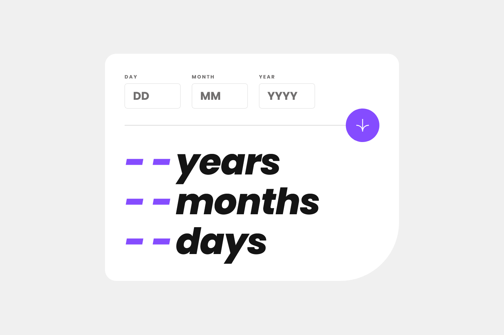
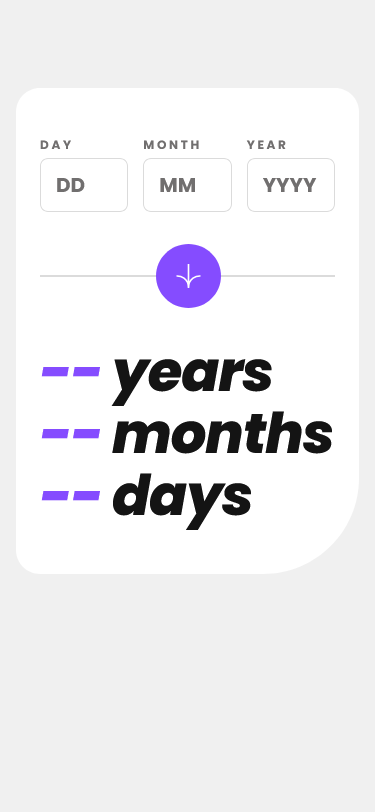

# Frontend Mentor - Age calculator app solution

This is a solution to the [Age calculator app challenge on Frontend Mentor](https://www.frontendmentor.io/challenges/age-calculator-app-dF9DFFpj-Q). Frontend Mentor challenges help you improve your coding skills by building realistic projects. 

## Table of contents

- [Overview](#overview)
  - [The challenge](#the-challenge)
  - [Screenshot](#screenshot)
  - [Links](#links)
- [My process](#my-process)
  - [Built with](#built-with)
  - [What I learned](#what-i-learned)
  - [Continued development](#continued-development)
- [Author](#author)

## Overview

### The challenge

Users should be able to:

- View an age in years, months, and days after submitting a valid date through the form
- Receive validation errors if:
  - Any field is empty when the form is submitted
  - The day number is not between 1-31
  - The month number is not between 1-12
  - The year is in the future
  - The date is invalid e.g. 31/04/1991 (there are 30 days in April)
- View the optimal layout for the interface depending on their device's screen size
- See hover and focus states for all interactive elements on the page
- **Bonus**: See the age numbers animate to their final number when the form is submitted

### Screenshot

### Links

- Solution URL: [GitHub Repo](https://github.com/CardboardPL/Frontend-Mentor-Age-Calculator-App)
- Live Site URL: [GitHub Pages](https://cardboardpl.github.io/Frontend-Mentor-Age-Calculator-App/)

## My process

### Built with

- Semantic HTML5 markup
- CSS custom properties
- Flexbox
- CSS Grid
- JavaScript
- Mobile-first workflow

### What I learned

While making this project, I learned how to calculate and validate dates. I also learned how to use promises to run code asynchronously so that the application will still work even if there is a counting operation.

Firstly, while I was implementing the date calculation functionality, I initially tried to get the time in milliseconds so that I could accurately calculate the date by getting the difference between today and a given date, which did not work as expected. So I instead went with another method, which is getting each component of the date, subtracting each component individually, and then carrying numbers over as needed to avoid negative values. 

Secondly, for date validation, I checked for invalid formats, such as months being outside the 1-12 range, days exceeding the maximum for a given month, and years either being in the future or having a length that is greater than or less than 4. 

Finally, I used promises to let a counting operation run asynchronously, allowing the application to remain responsive while also giving me the option to cancel it if necessary.

### Continued development

For future projects, I plan to use everything that I have learned here and do a planning phase before starting a new project to combat motivation issues, because during the implementation phase, I essentially slacked off and didn't make much progress.

## Author

- Frontend Mentor - [@CardboardPL](https://www.frontendmentor.io/profile/CardboardPL)
- Twitter - [@SirPLWasTaken](https://www.twitter.com/SirPLWasTaken)
